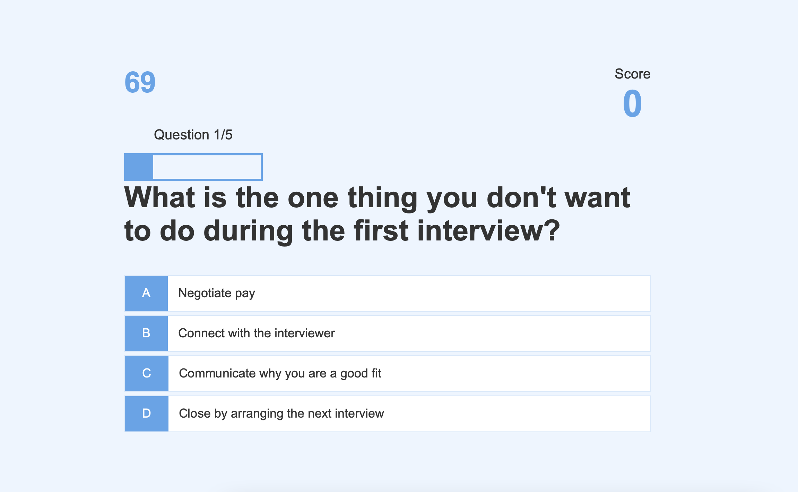
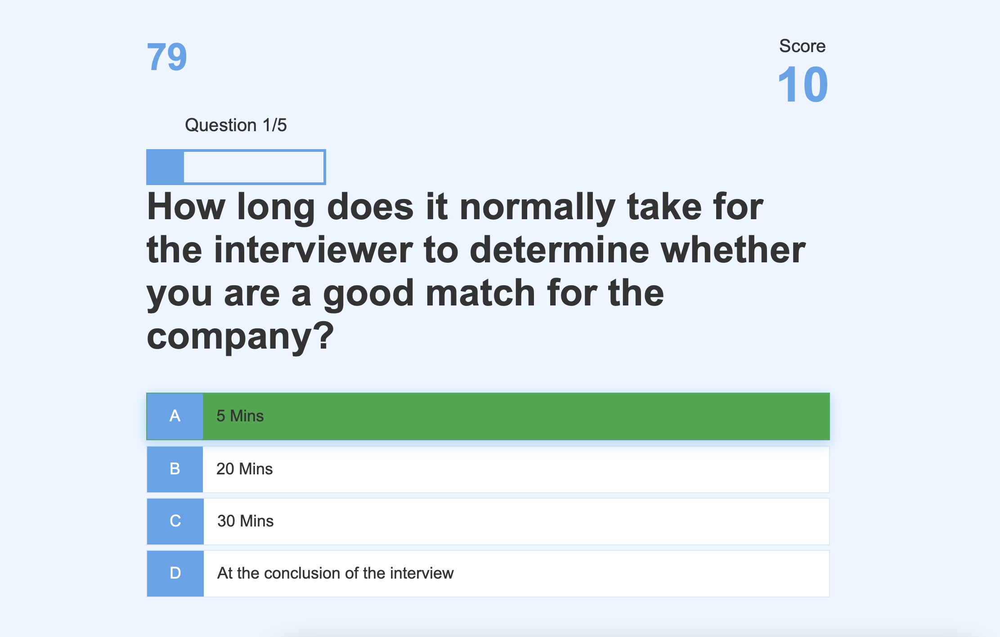
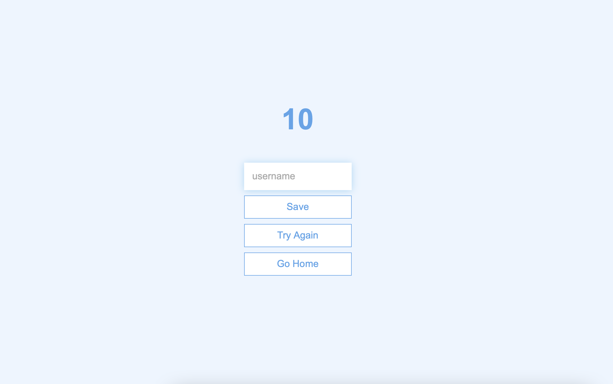

# JS-Quiz
This program is designed to quiz users about interview questions

The user will be timed

When user is asked a question, the user will be prompted 4 answers to choose from

If the selection is true, user will gain 10 points else user will need to select correct question in order to move on to next question

Upon completion, user can input name to save the score they acquired and can see previous attempts

Link: https://bee-13.github.io/JS-Quiz/

